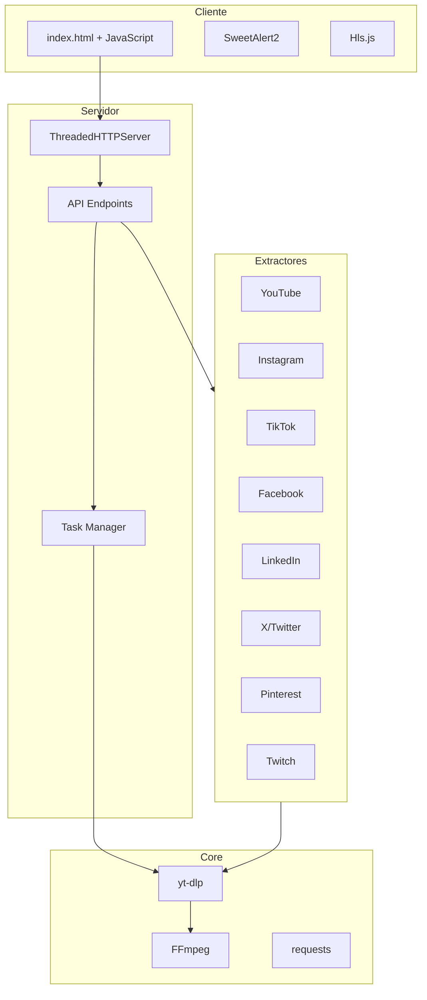
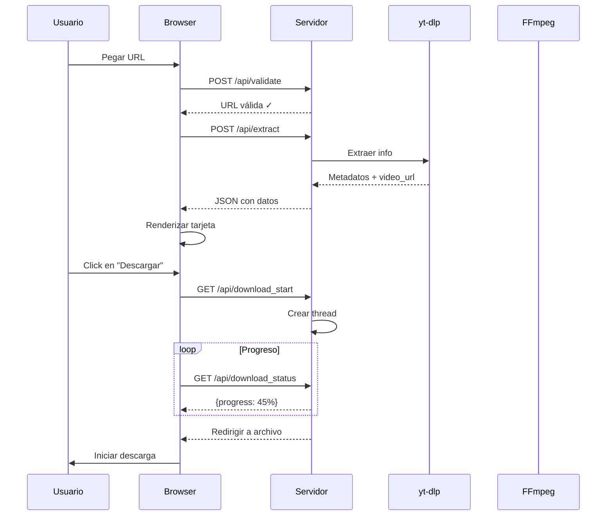

# 📹 Multi-Platform Video Downloader

## 🌟 Plataformas Soportadas

✅ **Instagram** - Posts, Reels, Stories y Videos Privados (con manejo de cookies)  
✅ **LinkedIn** - Videos de posts y Galerías de imágenes (descarga secuencial)  
✅ **X (Twitter)** - Videos de tweets (alta calidad garantizada)  
✅ **TikTok** - Videos sin marca de agua  
✅ **Facebook** - Videos públicos y Reels  
✅ **YouTube** - Videos y Shorts (Calidad Optimizada hasta 1080p + Audio)  
✅ **Pinterest** - Videos e Imágenes (Pin original)  
✅ **Twitch** - Clips y VODs  

---

## 🚀 Características Principales

- **UI/UX Unificada**: Misma experiencia para todas las plataformas desde una sola interfaz.
- **Calidad Optimizada**:
  - YouTube: Selección inteligente de video (1080p/720p) + audio fusionado.
  - X/Twitter: Enrutamiento especial para evitar errores 403.
  - Instagram: Soporte para historias y cuentas privadas (usando cookies del navegador).
- **Descargas Inteligentes**:
  - LinkedIn: Detecta si es video o galería. Si es galería, descarga imágenes secuencialmente (img-1, img-2...).
  - Archivos ZIP: Empaquetado automático para descargas múltiples.
- **Interfaz Responsiva**: Diseño moderno, adaptable a móviles y escritorio.
- **Logging Detallado**: Información completa de resolución, bitrate y errores en consola.
- **API REST Local**: Endpoints para validación y extracción, listos para integración.

---

## 📁 Estructura del Proyecto

```bash
c:\www\video-redes\
├── src/
│   ├── server.py                 # Servidor principal (Entry Point)
│   ├── common/                   # Recursos compartidos
│   │   ├── card.js               # Componente de tarjeta de video
│   │   └── style.css             # Estilos globales
│   ├── youtube/                  # Módulo YouTube
│   │   ├── youtube_extractor.py  # Extracción de videos/shorts
│   │   └── youtube.js            # Lógica de presentación
│   ├── instagram/                # Módulo Instagram
│   │   ├── insta_extractor.py    # Extracción con soporte cookies
│   │   └── insta.js              # Lógica de presentación
│   ├── tiktok/                   # Módulo TikTok
│   │   ├── tiktok_extractor.py   # Extracción con yt-dlp
│   │   └── tiktok.js             # Lógica de presentación
│   ├── facebook/                 # Módulo Facebook
│   │   ├── facebook_extractor.py # Extracción con fallbacks
│   │   └── facebook.js           # Lógica de presentación
│   ├── linkedin/                 # Módulo LinkedIn
│   │   ├── linkedin_extractor.py # Videos + galerías + PDFs
│   │   └── linkedin.js           # Lógica de presentación
│   ├── x/                        # Módulo X (Twitter)
│   │   ├── x_extractor.py        # Extracción de tweets
│   │   └── x.js                  # Lógica de presentación
│   ├── pinterest/                # Módulo Pinterest
│   │   ├── pinterest_extractor.py
│   │   └── pinterest.js
│   └── twitch/                   # Módulo Twitch
│       ├── twitch_extractor.py
│       └── twitch.js
├── index.html                    # Frontend principal
├── p.ps1                         # Script de inicio rápido (PowerShell)
├── Procfile                      # Configuración para despliegue
├── requirements.txt              # Dependencias del proyecto
├── runtime.txt                   # Versión de Python
└── README.md                     # Esta documentación
```

---

## 🏗️ Arquitectura del Sistema

### Stack Tecnológico

| Capa | Componente | Propósito |
|------|------------|-----------|
| **Backend** | Python 3.11+ | Lenguaje principal del servidor |
| **Backend** | http.server + socketserver | Servidor HTTP embebido con multithreading |
| **Backend** | yt-dlp | Biblioteca principal para extracción de videos |
| **Backend** | imageio-ffmpeg | Gestión de FFmpeg para procesamiento de video |
| **Backend** | requests | Cliente HTTP para scraping y proxy |
| **Backend** | threading | Manejo de descargas en segundo plano |
| **Frontend** | HTML5 + CSS3 | Estructura y estilos modernos |
| **Frontend** | Vanilla JavaScript | Lógica de cliente (ES6+) |
| **Frontend** | SweetAlert2 | Modales y notificaciones |
| **Frontend** | Hls.js | Reproducción de videos HLS (m3u8) |

### Diagrama de Arquitectura



### Flujo de Descarga



---

## 🔌 API Endpoints

### GET Endpoints

| Endpoint | Descripción |
|----------|-------------|
| `/` | Servir index.html |
| `/api/download_start?url=...&filename=...` | Iniciar tarea de descarga |
| `/api/download_cancel?id=task_id` | Cancelar descarga |
| `/api/download_status?id=task_id` | Consultar estado |
| `/api/download_file?id=task_id` | Descargar archivo completado |
| `/api/download?url=...&filename=...` | Descarga directa legacy |

### POST Endpoints

| Endpoint | Descripción |
|----------|-------------|
| `/api/validate` | Validar formato de URL |
| `/api/extract` | Extraer información de video |

### Ejemplo de Respuesta (extract)

```json
{
  "success": true,
  "title": "Video Title",
  "uploader": "Channel Name",
  "thumbnail": "https://...",
  "video_url": "https://...mp4",
  "video_quality": "1080p",
  "duration": 120,
  "filesize": "50.5 MB",
  "platform": "YouTube"
}
```

---

## 🛡️ Seguridad

| Protección | Descripción |
|------------|-------------|
| **SSRF Protection** | Validación de protocolo (solo http/https) |
| **Path Traversal** | Validación de rutas con `commonpath` |
| **Hostname Blocklist** | Bloqueo de IPs privadas locales |
| **CORS** | Headers configurables por origen |

---

## 💾 Instalación y Uso Local

### 1. Prerrequisitos

* **Python 3.11+**: Asegúrate de tener Python instalado y agregado al PATH.
* **FFmpeg**: Necesario para unir video y audio en alta calidad.
  * *Windows*: Descargar de [ffmpeg.org](https://ffmpeg.org/download.html) y agregar `bin` al PATH.

### 2. Configuración Inicial

```powershell
# Clonar/Descargar el repositorio
cd c:\www\video-redes

# Crear entorno virtual
python -m venv .venv

# Activar entorno (PowerShell)
.venv\Scripts\Activate.ps1

# Instalar dependencias
pip install -r requirements.txt
```

### 3. Ejecutar el Servidor

**Opción A: Script Automático (Recomendado)**
```powershell
.\p.ps1
```

**Opción B: Manual**
```powershell
python src/server.py
```

### 4. Usar la Aplicación

1. Abre tu navegador en `http://localhost:8000`
2. Pega el enlace de la red social
3. El sistema detectará automáticamente la plataforma
4. Haz clic en **"Buscar Video"** para ver la vista previa
5. Haz clic en **"Descargar Video"**

---

## ☁️ Despliegue en la Nube (Railway/Heroku)

El proyecto está configurado para desplegarse fácilmente ("Deploy Ready").

**Archivos Clave:**
- `Procfile`: `web: python src/server.py`
- `runtime.txt`: `python-3.11`
- `requirements.txt`: Lista de librerías necesarias

**Pasos para Railway:**
1. Sube tu código a GitHub
2. Crea nuevo proyecto en Railway desde GitHub
3. Railway detectará el `Procfile` y desplegará automáticamente

---

## 🔧 Detalles Técnicos de los Extractores

### YouTube Extractor
- Detecta YouTube Shorts automáticamente
- Prioriza formatos progresivos (video+audio)
- Detecta calidad máxima DASH
- Calcula tamaño estimado

### Instagram Extractor
- URLs directas de CDN (cdninstagram.com)
- Fallback a yt-dlp con cookies del navegador
- Manejo de contenido privado/stories

### LinkedIn Extractor
- Videos (yt-dlp)
- Galerías de imágenes (JSON-LD parsing)
- Documentos PDFs (native document config)

### Facebook Extractor
- yt-dlp como método principal
- Fallback: scraping og:video + playable_url
- Tercer fallback: servicio externo (fdown.net)

### TikTok Extractor
- yt-dlp con formato bestvideo+bestaudio

### X/Twitter Extractor
- yt-dlp con merge_output_format=mp4
- Selección de mejor calidad por resolución

### Pinterest Extractor
- Soporte para pins de video e imagen

### Twitch Extractor
- Clips y VODs via yt-dlp

---

## 🆘 Solución de Problemas Comunes

### Error: "Instagram authentication required" / "Private account"
- **Causa**: Estás intentando bajar una historia o un video de una cuenta privada.
- **Solución**: El servidor intentará usar las cookies de tu navegador (Chrome/Edge) localmente. Asegúrate de haber iniciado sesión en Instagram.
- *Nota*: Si el error persiste ("Permission denied"), cierra el navegador completamente.

### Error: "403 Forbidden" en X/Twitter
- **Solución**: Ya está parchado internamente. El sistema usa `twimg.com` para evitar el bloqueo.

### Error: "FFmpeg not found"
- **Solución**: Instala FFmpeg y agrégalo a tus variables de entorno.

### La descarga es lenta en local
- **Causa**: El video se descarga primero a tu carpeta temporal y luego se te envía.
- **Normalidad**: Es el comportamiento esperado para garantizar que el archivo final esté limpio.

---

## ⚠️ Aviso Legal

Esta herramienta ha sido creada con fines educativos y de uso personal.
- Respeta los derechos de autor y la propiedad intelectual.
- No descargues ni redistribuyas contenido privado sin consentimiento.
- El usuario es responsable del uso que le dé a esta herramienta.

---

*Documentación actualizada: Enero 2025*  
📧 Contacto: [julio.corbaz@gmail.com](mailto:julio.corbaz@gmail.com)
🌐 **Página Web Oficial**: [https://redes-download.up.railway.app/](https://redes-download.up.railway.app/)
*Versión del proyecto: 32*
