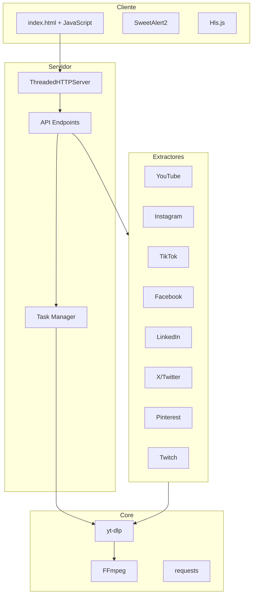
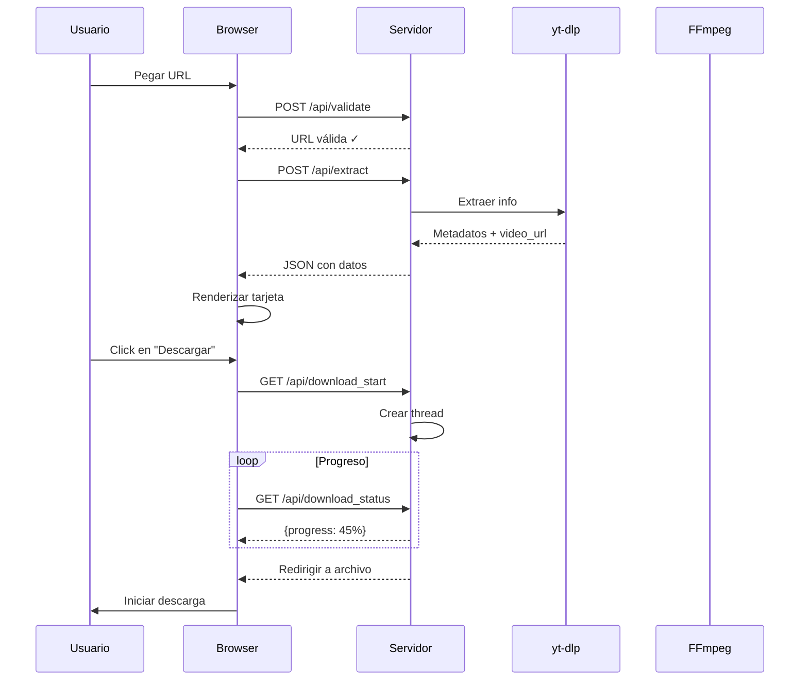

# 📹 Multi-Platform Video Downloader

## 🌟 Plataformas Soportadas

✅ **Instagram** - Posts, Reels, Stories y Videos Privados (cookies + proxy de embeds)  
✅ **LinkedIn** - Videos de posts y Galerías de imágenes (descarga secuencial)  
✅ **X (Twitter)** - Videos de tweets (alta calidad garantizada)  
✅ **TikTok** - Videos sin marca de agua  
✅ **Facebook** - Videos públicos, Reels y enlaces `share/v/` (múltiples fallbacks)  
✅ **YouTube** - Videos y Shorts (Calidad Optimizada hasta 1080p + Audio)  
✅ **Pinterest** - Videos e Imágenes (Pin original)  
✅ **Twitch** - Clips y VODs  

---

## 🚀 Características Principales

- **UI/UX Unificada**: Misma experiencia para todas las plataformas desde una sola interfaz.
- **Calidad Optimizada**:
  - YouTube: Selección inteligente de video (1080p/720p) + audio fusionado.
  - X/Twitter: Enrutamiento especial para evitar errores 403.
  - Instagram: Soporte para historias y cuentas privadas (usando cookies del navegador).
- **Descargas Inteligentes**:
  - LinkedIn: Detecta si es video o galería. Si es galería, descarga imágenes secuencialmente (img-1, img-2...).
  - Archivos ZIP: Empaquetado automático para descargas múltiples.
- **Nombres de Archivo Unificados**: Todas las descargas siguen el formato `plataforma_titulo_fecha.ext` (ej. `instagram_Mar_del_Plata_Drone_20260702.mp4`). Generado por `buildFilename()` en `src/common/card.js`.
- **Autenticación con Cookies (Instagram)**: Soporte para archivo de cookies Netscape en `cookies/instagram.txt` (o variable de entorno `INSTAGRAM_COOKIES_FILE`). Necesario porque Instagram exige login para la mayoría de los reels. Exportar con la extensión "Get cookies.txt LOCALLY". El directorio `cookies/` está en `.gitignore`.
- **Interfaz Responsiva**: Diseño moderno, adaptable a móviles y escritorio.
- **Logging Detallado**: Información completa de resolución, bitrate y errores en consola.
- **API REST Local**: Endpoints para validación y extracción, listos para integración.

---

## 📁 Estructura del Proyecto

```bash
c:\www\video-redes\
├── src/
│   ├── server.py                 # Servidor principal (Entry Point)
│   ├── common/                   # Recursos compartidos
│   │   ├── card.js               # Tarjeta de video + buildFilename()
│   │   ├── ytdlp_cmd.py          # Resolución del ejecutable yt-dlp (venv/PATH/módulo)
│   │   └── style.css             # Estilos globales
│   ├── youtube/                  # Módulo YouTube
│   │   ├── youtube_extractor.py  # Extracción de videos/shorts
│   │   └── youtube.js            # Lógica de presentación
│   ├── instagram/                # Módulo Instagram
│   │   ├── insta_extractor.py    # Extracción con soporte cookies
│   │   └── insta.js              # Lógica de presentación
│   ├── tiktok/                   # Módulo TikTok
│   │   ├── tiktok_extractor.py   # Extracción con yt-dlp
│   │   └── tiktok.js             # Lógica de presentación
│   ├── facebook/                 # Módulo Facebook
│   │   ├── facebook_extractor.py # Extracción con fallbacks
│   │   └── facebook.js           # Lógica de presentación
│   ├── linkedin/                 # Módulo LinkedIn
│   │   ├── linkedin_extractor.py # Videos + galerías + PDFs
│   │   └── linkedin.js           # Lógica de presentación
│   ├── x/                        # Módulo X (Twitter)
│   │   ├── x_extractor.py        # Extracción de tweets
│   │   └── x.js                  # Lógica de presentación
│   ├── pinterest/                # Módulo Pinterest
│   │   ├── pinterest_extractor.py
│   │   └── pinterest.js
│   └── twitch/                   # Módulo Twitch
│       ├── twitch_extractor.py
│       └── twitch.js
├── cookies/                      # (no versionado) instagram.txt para contenido con login
├── index.html                    # Frontend principal
├── p.ps1                         # Script de inicio rápido (PowerShell)
├── p.bat                         # Script de inicio rápido (CMD, activa .venv)
├── Procfile                      # Configuración para despliegue
├── requirements.txt              # Dependencias del proyecto
├── runtime.txt                   # Versión de Python
└── README.md                     # Esta documentación
```

---

## 🏗️ Arquitectura del Sistema

### Stack Tecnológico

| Capa | Componente | Propósito |
|------|------------|-----------|
| **Backend** | Python 3.11+ | Lenguaje principal del servidor |
| **Backend** | http.server + socketserver | Servidor HTTP embebido con multithreading |
| **Backend** | yt-dlp | Biblioteca principal para extracción de videos |
| **Backend** | imageio-ffmpeg | Gestión de FFmpeg para procesamiento de video |
| **Backend** | requests | Cliente HTTP para scraping y proxy |
| **Backend** | threading | Manejo de descargas en segundo plano |
| **Frontend** | HTML5 + CSS3 | Estructura y estilos modernos |
| **Frontend** | Vanilla JavaScript | Lógica de cliente (ES6+) |
| **Frontend** | SweetAlert2 | Modales y notificaciones |
| **Frontend** | Hls.js | Reproducción de videos HLS (m3u8) |

### Diagrama de Arquitectura


```mermaid
flowchart TB
    subgraph Cliente
        UI[index.html + JavaScript]
        SWEET[SweetAlert2]
        HLS[Hls.js]
    end
    
    subgraph Servidor
        HTTP[ThreadedHTTPServer]
        API[API Endpoints]
        TASK[Task Manager]
    end
    
    subgraph Extractores
        YT[YouTube]
        IG[Instagram]
        TT[TikTok]
        FB[Facebook]
        LI[LinkedIn]
        X[X/Twitter]
        PI[Pinterest]
        TW[Twitch]
    end
    
    subgraph Core
        YTDLP[yt-dlp]
        FFMPEG[FFmpeg]
        REQ[requests]
    end
    
    UI --> HTTP
    HTTP --> API
    API --> TASK
    API --> Extractores
    Extractores --> YTDLP
    TASK --> YTDLP
    YTDLP --> FFMPEG
```

### Flujo de Descarga


```mermaid
sequenceDiagram
    participant U as Usuario
    participant B as Browser
    participant S as Servidor
    participant Y as yt-dlp
    participant F as FFmpeg

    U->>B: Pegar URL
    B->>S: POST /api/validate
    S-->>B: URL válida ✓
    B->>S: POST /api/extract
    S->>Y: Extraer info
    Y-->>S: Metadatos + video_url
    S-->>B: JSON con datos
    B->>B: Renderizar tarjeta
    U->>B: Click en "Descargar"
    B->>S: GET /api/download_start
    S->>S: Crear thread
    loop Progreso
        B->>S: GET /api/download_status
        S-->>B: {progress: 45%}
    end
    S-->>B: Redirigir a archivo
    B->>U: Iniciar descarga
```

---

## 🔌 API Endpoints

### GET Endpoints

| Endpoint | Descripción |
|----------|-------------|
| `/` | Servir index.html |
| `/api/download_start?url=...&filename=...` | Iniciar tarea de descarga |
| `/api/download_cancel?id=task_id` | Cancelar descarga |
| `/api/download_status?id=task_id` | Consultar estado |
| `/api/download_file?id=task_id` | Descargar archivo completado |
| `/api/download?url=...&filename=...` | Descarga directa legacy |

### POST Endpoints

| Endpoint | Descripción |
|----------|-------------|
| `/api/validate` | Validar formato de URL |
| `/api/extract` | Extraer información de video |

### Ejemplo de Respuesta (extract)

```json
{
  "success": true,
  "title": "Video Title",
  "uploader": "Channel Name",
  "thumbnail": "https://...",
  "video_url": "https://...mp4",
  "video_quality": "1080p",
  "duration": 120,
  "filesize": "50.5 MB",
  "platform": "YouTube"
}
```

---

## 🛡️ Seguridad

| Protección | Descripción |
|------------|-------------|
| **SSRF Protection** | Validación de protocolo (solo http/https) |
| **Path Traversal** | Validación de rutas con `commonpath` |
| **Hostname Blocklist** | Bloqueo de IPs privadas locales |
| **CORS** | Headers configurables por origen |

---

## 💾 Instalación y Uso Local

### 1. Prerrequisitos

* **Python 3.11+**: Asegúrate de tener Python instalado y agregado al PATH.
* **FFmpeg**: Necesario para unir video y audio en alta calidad.
  * *Windows*: Descargar de [ffmpeg.org](https://ffmpeg.org/download.html) y agregar `bin` al PATH.

### 2. Configuración Inicial

```powershell
# Clonar/Descargar el repositorio
cd c:\www\video-redes

# Crear entorno virtual
python -m venv .venv

# Activar entorno (PowerShell)
.venv\Scripts\Activate.ps1

# Instalar dependencias
pip install -r requirements.txt
```

### 3. Ejecutar el Servidor

**Opción A: Script Automático (Recomendado)**
```powershell
.\p.ps1
```

**Opción B: Manual**
```powershell
python src/server.py
```

### 4. Usar la Aplicación

1. Abre tu navegador en `http://localhost:8000`
2. Pega el enlace de la red social
3. El sistema detectará automáticamente la plataforma
4. Haz clic en **"Buscar Video"** para ver la vista previa
5. Haz clic en **"Descargar Video"**

---

## ☁️ Despliegue en la Nube (Railway/Heroku)

El proyecto está configurado para desplegarse fácilmente ("Deploy Ready").

**Archivos Clave:**
- `Procfile`: `web: python src/server.py`
- `runtime.txt`: `python-3.11`
- `requirements.txt`: Lista de librerías necesarias
- `nixpacks.toml`: Agrega `deno` al build — requerido por yt-dlp 2026+ para YouTube

**Pasos para Railway:**
1. Sube tu código a GitHub
2. Crea nuevo proyecto en Railway desde GitHub
3. Railway detectará el `Procfile` y desplegará automáticamente

**Instagram en Railway:** el servidor no tiene navegador ni filesystem persistente, así que el contenido que exige login necesita una cookie compartida (una sola sesión de Instagram usada para todos los visitantes — nadie inicia sesión con su propia cuenta).

**Configuración inicial (una vez):**
1. Codificar el archivo local en Base64 (PowerShell):
   ```powershell
   [Convert]::ToBase64String([IO.File]::ReadAllBytes("cookies\instagram.txt")) | Set-Clipboard
   ```
2. En Railway → tu proyecto → **Variables** → crear `INSTAGRAM_COOKIES_B64` y pegar el valor (queda en el portapapeles).
3. Al arrancar, `server.py` decodifica esa variable a un archivo temporal y configura `INSTAGRAM_COOKIES_FILE` automáticamente.

**Panel admin para renovarla sin volver a tocar Railway:**
- Configurar la variable `ADMIN_SECRET` (una contraseña elegida por vos) en Railway.
- Entrar a `https://tu-app.up.railway.app/admin/cookies`, poner la clave, pegar el contenido nuevo de `cookies/instagram.txt` y guardar. Se actualiza al instante, sin reiniciar el server.
- Sin `ADMIN_SECRET` configurada, el panel queda deshabilitado (403) — no expone nada si no lo activás.

**Refresco automático:** el servidor usa la cookie compartida cada 6 horas en segundo plano para extender su vigencia. Esto no la hace eterna — Instagram igual la vence eventualmente — pero reduce cuánto hay que estar pendiente de renovarla a mano.

Sin cookie configurada, en Railway solo funcionan los reels públicos (vía proxy de embeds); el resto necesita la cookie compartida.

---

## 🔧 Detalles Técnicos de los Extractores

### YouTube Extractor
- Detecta YouTube Shorts automáticamente
- Prioriza formatos progresivos (video+audio)
- Detecta calidad máxima DASH
- Calcula tamaño estimado

### Instagram Extractor
Cadena de extracción (de más rápido a más lento):
1. URLs directas de CDN (cdninstagram.com) — sin extracción
2. yt-dlp anónimo
3. Archivo de cookies `cookies/instagram.txt` (recomendado — Instagram exige login para la mayoría de los reels desde 2026)
4. Proxy de embeds (kkinstagram, estilo InstaFix) — resuelve reels públicos sin login, redirige al mp4 del CDN oficial
5. Cookies del navegador Chrome/Edge/Firefox (último recurso; falla si el navegador está abierto, y Chrome moderno usa App-Bound Encryption que yt-dlp no puede desencriptar)

Detecta los errores de autenticación modernos ("empty media response", "login required", "rate-limit").

### LinkedIn Extractor
- Videos (yt-dlp)
- Galerías de imágenes (JSON-LD parsing)
- Documentos PDFs (native document config)

### Facebook Extractor
Cadena de extracción:
1. yt-dlp como método principal
2. Scraping manual: og:video + playable_url (web y móvil)
3. Servicio externo fdown.net
4. Servicio externo getmyfb.com (endpoint `/process`) — resuelve enlaces `share/v/` que exigen login y devuelve el título real del video

### TikTok Extractor
- yt-dlp con formato bestvideo+bestaudio

### X/Twitter Extractor
- yt-dlp con merge_output_format=mp4
- Selección de mejor calidad por resolución

### Pinterest Extractor
- Soporte para pins de video e imagen

### Twitch Extractor
- Clips y VODs via yt-dlp

---

## 🆘 Solución de Problemas Comunes

### Error: "Instagram exige iniciar sesión" / "empty media response"
- **Causa**: Instagram exige login para la mayoría de los reels (comportamiento desde 2026). No es un bug de la app.
- **Solución recomendada (permanente)**: Exportar cookies con la extensión "Get cookies.txt LOCALLY" en Chrome (logueado en Instagram) y guardarlas como `cookies/instagram.txt`. Funciona local y en Railway.
- **Alternativa**: Cerrar completamente Chrome/Edge para que yt-dlp lea las cookies del navegador. *Nota*: Chrome moderno (v127+) cifra las cookies con App-Bound Encryption y yt-dlp puede fallar con "Failed to decrypt with DPAPI" — en ese caso la extensión es la única vía.
- Las cookies caducan: si el error reaparece tras semanas, re-exportar el archivo.

### Error: Facebook "No se pudo extraer la URL del video"
- **Causa**: Los enlaces `facebook.com/share/v/...` suelen exigir login.
- **Solución**: Ya está cubierto — el extractor cae automáticamente en getmyfb.com como último recurso. Si aun así falla, el video puede ser privado o de un grupo cerrado.

### Error: "403 Forbidden" en X/Twitter
- **Solución**: Ya está parchado internamente. El sistema usa `twimg.com` para evitar el bloqueo.

### Error: "FFmpeg not found"
- **Solución**: Instala FFmpeg y agrégalo a tus variables de entorno.

### La descarga es lenta en local
- **Causa**: El video se descarga primero a tu carpeta temporal y luego se te envía.
- **Normalidad**: Es el comportamiento esperado para garantizar que el archivo final esté limpio.

---

## ⚠️ Aviso Legal

Esta herramienta ha sido creada con fines educativos y de uso personal.
- Respeta los derechos de autor y la propiedad intelectual.
- No descargues ni redistribuyas contenido privado sin consentimiento.
- El usuario es responsable del uso que le dé a esta herramienta.

---

## 📋 Novedades v.33 (Julio 2026)

- **yt-dlp actualizado** a 2026.6.9 (corrige el aviso "version older than 90 days") junto con todas las dependencias. `pydub` eliminada (sin uso e incompatible con Python 3.13+).
- **Instagram**: nueva cadena de fallbacks — archivo de cookies (`cookies/instagram.txt`) + proxy de embeds (kkinstagram) para reels públicos sin login. Detección de los errores de autenticación modernos.
- **Facebook**: nuevo fallback getmyfb.com para enlaces `share/v/` que exigen login.
- **Nombres de archivo unificados**: `plataforma_titulo_fecha.ext` en las 8 plataformas (helper `buildFilename()` compartido).
- **Resolución robusta de yt-dlp**: `src/common/ytdlp_cmd.py` localiza el ejecutable (venv → PATH → módulo Python); los extractores ya no dependen del PATH.
- **server.py**: lógica de reintentos de Instagram unificada en `download_with_instagram_auth()` (archivo de cookies → Chrome → Edge → Firefox).
- **p.bat** ahora activa el entorno virtual antes de arrancar (igual que p.ps1).
- **server.log** fuera del control de versiones (queda solo local).

---

*Documentación actualizada: Julio 2026*  
📧 Contacto: [julio.corbaz@gmail.com](mailto:julio.corbaz@gmail.com)
🌐 **Página Web Oficial**: [https://redes-download.up.railway.app/](https://redes-download.up.railway.app/)
*Versión del proyecto: 33*
